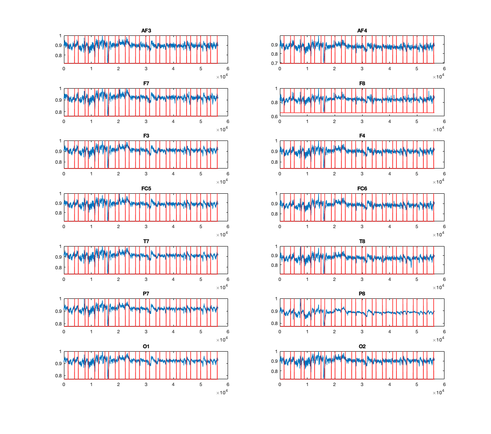
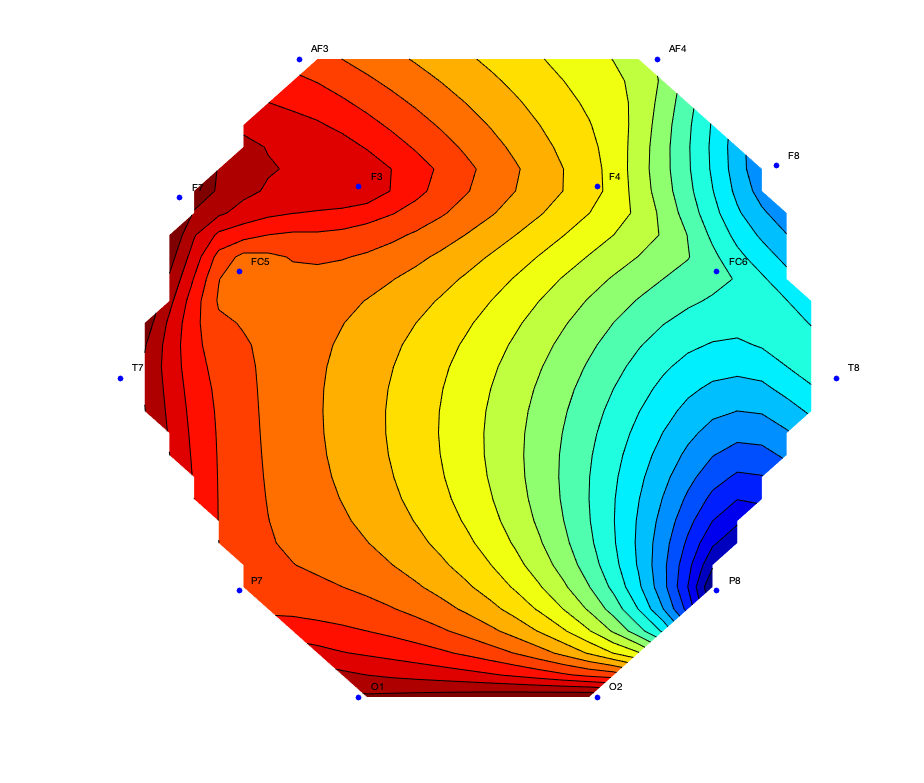

# EEG processing

## plotall.m

plotall function plots all the channel signals containg 
in the .edf (Europian Data Format) file which is generated 
by EMOTIV EPOC+ headset.

Input: Path to .edf file (ex: <folder_name>/<file>.edf)
Output: Matrix of 14 channel data (14x<data_length>)      

Output looks like this.

## scatter2dall.m

This function generates set of scatter plots of all possible 
combination of binary feature sets

Input: param1: Data matrix with any number of features (mxn)  
       param2: labels for the given data set(only two classes)
       param3: integer valuse representing the section of     
               plots to show                        

Output: Scatter plots with 20 maximum plots 

## topograph.m

This function generates a topographic plot for given EDF file.

Input: Path to .edf file (ex: <folder_name>/<file>.edf)

Output looks like this.

